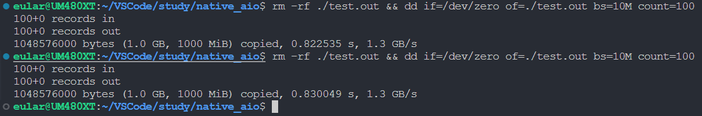
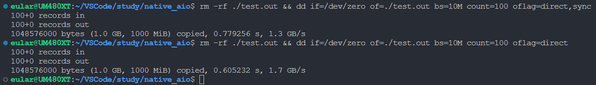
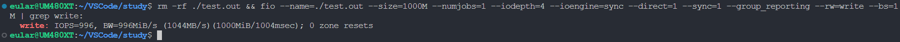

https://www.cnblogs.com/wyk930511/p/7414229.html

#### 磁盘型号 GALAX QA1N0512N

dd 不直接使用aio

`rm -rf ./test.out && dd if=/dev/zero of=./test.out bs=10M count=100`
不加`O_DIRECT`标志时耗时最久

rm -rf ./test.out && dd if=/dev/zero of=./test.out bs=10M count=100 oflag=direct

rm -rf ./test.out && dd if=/dev/zero of=./test.out bs=10M count=100 oflag=direct,sync

fio 默认使用aio

不使用direct标志位
`rm -rf ./test.out && fio --name=./test.out --size=1000M --numjobs=1 --iodepth=4 --ioengine=sync --group_reporting --rw=write --bs=1M | grep write:`

使用direct标志位
`rm -rf ./test.out && fio --name=./test.out --size=1000M --numjobs=1 --iodepth=4 --ioengine=sync --direct=1 --group_reporting --rw=write --bs=1M | grep write:`

加上`--sync=1`标志
`rm -rf ./test.out && fio --name=./test.out --size=1000M --numjobs=1 --iodepth=4 --ioengine=sync --direct=1 --sync=1 --group_reporting --rw=write --bs=1M | grep write:`

